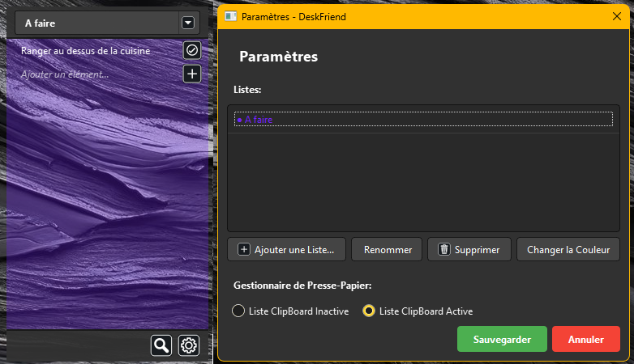

# DeskFriend

DeskFriend est un assistant de bureau léger et discret conçu pour améliorer votre productivité. Il vous permet de gérer vos tâches, de conserver un historique de votre presse-papier et de garder vos notes importantes toujours à portée de main.


## Fonctionnalités

*   **Listes Multiples** : Créez, renommez et gérez plusieurs listes de tâches ou de notes.
*   **Code Couleur** : Personnalisez la couleur de chaque liste pour une meilleure organisation visuelle.
*   **Gestionnaire de Presse-Papier** :
    *   Enregistre automatiquement l'historique de votre presse-papier.
    *   Détection intelligente des doublons pour éviter l'encombrement.
    *   Possibilité d'activer/désactiver la surveillance du presse-papier.
*   **Recherche Globale** : Retrouvez rapidement n'importe quel élément (texte ou date) à travers toutes vos listes.
*   **Interface Discrète** :
    *   Fenêtre "Toujours au premier plan" (Always on Top) pour garder vos notes visibles.
    *   Transparence et design sombre pour s'intégrer élégamment à votre bureau.
    *   Redimensionnable et déplaçable facilement.
*   **Actions Rapides** :
    *   Menu contextuel pour copier rapidement le contenu des éléments.
    *   Raccourcis et boutons intuitifs.

## Installation

### Prérequis

*   Python 3.10 ou supérieur
*   Les dépendances listées dans `requirements.txt`

### Installation depuis les sources

1.  Clonez le dépôt :
    ```bash
    git clone https://github.com/votre-utilisateur/DeskFriend.git
    cd DeskFriend
    ```

2.  Installez les dépendances :
    ```bash
    pip install -r requirements.txt
    ```

3.  Lancez l'application :
    ```bash
    python main.py
    ```

## Compilation (Windows)

Pour créer un exécutable autonome `.exe` :

1.  Assurez-vous d'avoir `pyinstaller` installé :
    ```bash
    pip install pyinstaller
    ```

2.  Lancez la compilation via le fichier spec inclus :
    ```bash
    python -m PyInstaller deskfriend.spec
    ```

3.  L'exécutable se trouvera dans le dossier `dist/`.

## Technologies Utilisées

*   **Python** : Langage principal.
*   **PyQt6** : Framework pour l'interface graphique.
*   **JSON** : Stockage des données localement.

## Auteur

Développé avec passion pour simplifier votre flux de travail quotidien.


Tuto Description :

# Guide d'utilisation de DeskFriend

Bienvenue dans DeskFriend, votre compagnon de bureau pour gérer vos listes et votre presse-papier en toute simplicité. Ce guide vous expliquera comment utiliser toutes les fonctionnalités de l'application.

## 1. Premiers Pas

Au premier lancement, l'application s'ouvre sur la fenêtre des **Paramètres**.
*   **Créer une liste** : Cliquez sur le bouton "Ajouter une Liste..." (+).
*   **Choisir une couleur** : Sélectionnez une couleur pour identifier votre liste.
*   Une fois validé, votre première liste apparaît sur le bureau sous forme d'une fenêtre semi-transparente.

## 2. L'Interface de la Liste

La fenêtre de liste est conçue pour être discrète et toujours accessible (Always on Top).

*   **Déplacer la fenêtre** : Cliquez et maintenez le clic sur l'en-tête (titre) ou le pied de page (bas de la fenêtre) pour la déplacer.
*   **Redimensionner** : Placez votre souris sur les bords ou les coins de la fenêtre. Le curseur changera pour indiquer que vous pouvez cliquer et glisser pour agrandir ou réduire la fenêtre.
*   **Changer de liste** : Utilisez le menu déroulant (petite flèche) à côté du titre pour basculer instantanément entre vos différentes listes.

## 3. Gestion des Tâches et Notes

### Ajouter un élément
*   Cliquez sur la zone de texte en bas de la liste ("Ajouter un élément...").
*   Tapez votre texte et appuyez sur **Entrée** ou cliquez sur le bouton (+).

### Consulter et Éditer
*   **Info-bulle (Mouse Over)** : Passez simplement votre souris sur un élément pour voir :
    *   Le texte complet (utile s'il est tronqué par "..." dans la liste).
    *   La date et l'heure de création.
    *   La date de modification (si applicable).
    *   La date de validation (si l'élément est barré).
*   **Modifier** : Double-cliquez sur un élément pour éditer son texte.

### Valider et Supprimer
*   **Valider** : Cliquez sur la case à cocher à gauche d'un élément. Il sera barré.
*   **Annuler la validation** : Double-cliquez sur un élément barré pour le remettre en normal.
*   **Supprimer** : Une fois un élément validé (barré), l'icône de la case devient une **Corbeille**. Cliquez dessus pour supprimer définitivement l'élément.

### Actions Rapides (Clic Droit)
*   Faites un **clic droit** sur n'importe quel élément de la liste pour ouvrir le menu contextuel.
*   Sélectionnez **"Copier vers le Presse-Papier"** pour copier le texte de l'élément.

## 4. Le Gestionnaire de Presse-Papier (Clipboard)

DeskFriend peut enregistrer automatiquement ce que vous copiez sur votre ordinateur.

*   **Activer/Désactiver** : Allez dans les Paramètres (roue crantée en bas) et choisissez "Liste ClipBoard Active" ou "Inactive".
*   **Accéder à l'historique** : Si activé, une liste spéciale nommée **"Clipboard"** apparaît dans le menu déroulant des listes.
*   **Fonctionnement** :
    *   Chaque fois que vous faites "Copier" (Ctrl+C) dans n'importe quelle application, le texte s'ajoute automatiquement à cette liste.
    *   **Anti-doublon** : Si vous copiez un texte qui est déjà dans la liste, il ne sera pas ajouté une deuxième fois pour éviter d'encombrer l'historique.
    *   **Suppression directe** : Contrairement aux autres listes, les éléments du Clipboard ont directement une icône Corbeille pour les supprimer rapidement.

## 5. Recherche Globale

Retrouvez n'importe quoi, n'importe où.

*   Cliquez sur l'icône **Loupe** en bas de la fenêtre.
*   Tapez votre recherche. DeskFriend cherche dans :
    *   Le contenu de toutes vos listes (y compris le Clipboard).
    *   Les dates et heures (création, modification, validation).
*   **Résultats** : Double-cliquez sur un résultat pour aller directement à la liste concernée.
*   **Copie rapide** : Vous pouvez aussi faire un clic droit sur un résultat de recherche pour le copier.

## 6. Paramètres Avancés

Cliquez sur l'icône **Roue Crantée** en bas pour ouvrir les paramètres.
*   **Gérer les listes** :
    *   **Ajouter** : Créer de nouvelles listes.
    *   **Renommer** : Changer le nom de la liste sélectionnée.
    *   **Changer la Couleur** : Modifier la couleur de la liste sélectionnée.
    *   **Supprimer** : Effacer une liste entière.
*   **Presse-Papier** : Activer ou désactiver la surveillance du presse-papier.

---
*Profitez de votre nouveau compagnon de productivité !*


